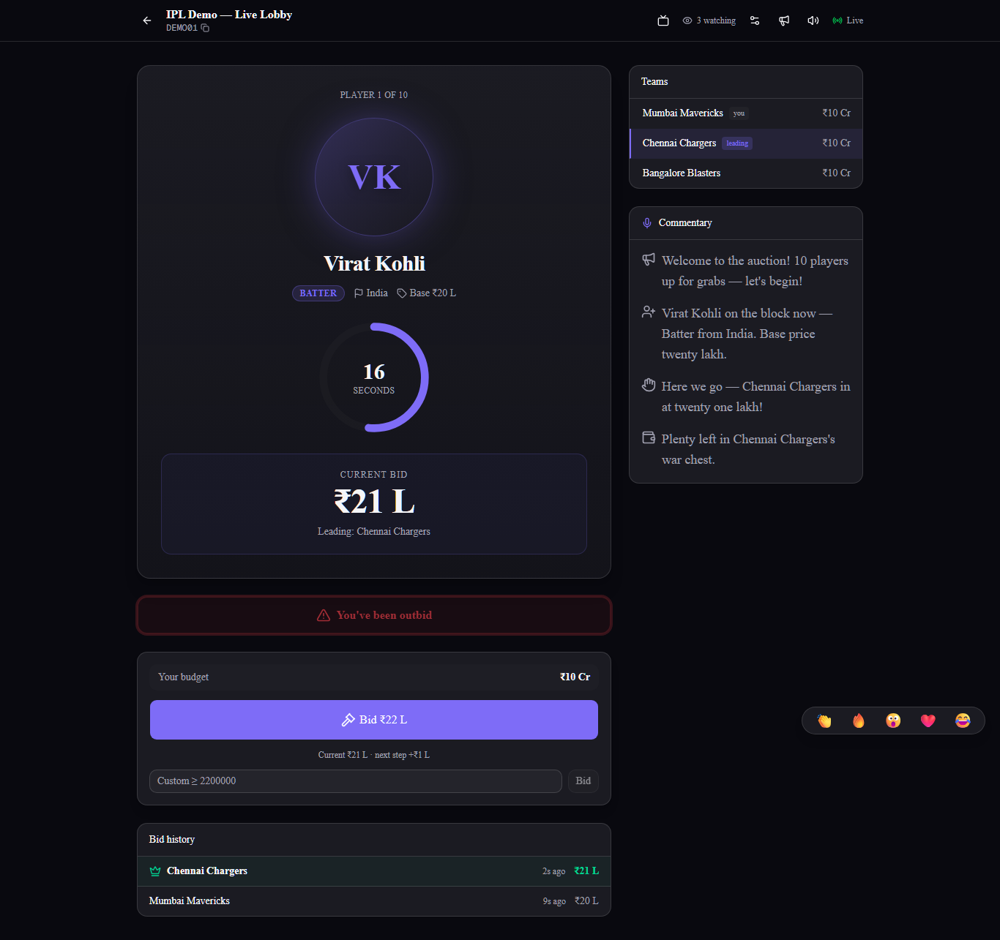
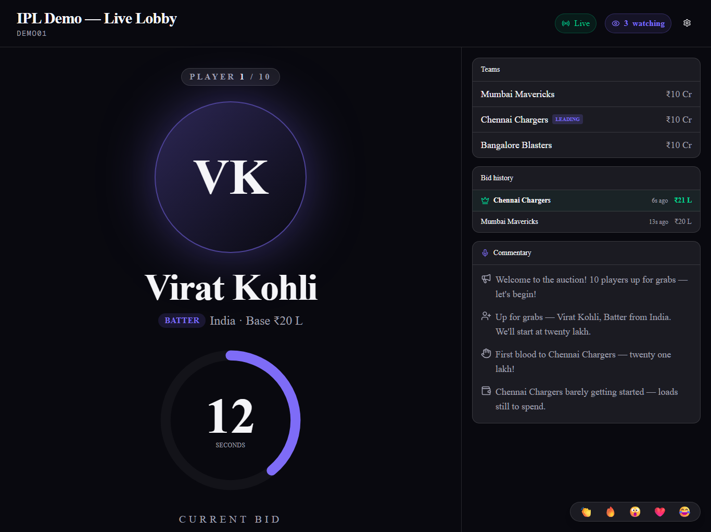

# Realtime Auction Room

An IPL-style live auction room: an admin runs a room, players come up one at a time, bidder teams bid live against a server-authoritative countdown, and each player is sold to the top bidder or marked unsold — ending on a results page. Flow: **LOBBY → AUCTION → COMPLETED**.




## Live Demo

**https://auction-room-gamma.vercel.app** — log in with a demo account below.

## Demo Credentials

All accounts use the password **`auction123`**.

| Email | Role | Team |
|-------|------|------|
| `admin@demo.test` | Auction admin — runs auctions, **does not bid** | — |
| `team1@demo.test` | Bidder | Mumbai Mavericks |
| `team2@demo.test` | Bidder | Chennai Chargers |
| `team3@demo.test` | Bidder | Bangalore Blasters |

Once logged in, two seeded demo rooms (**DEMO01** + **DEMO02**) are visible to every user on the dashboard — no join code needed.

### Try it in 2 minutes

1. Log in as **`admin@demo.test`** in one window, open **DEMO01**, and click **Start auction**.
2. Log in as **`team1@demo.test`** and **`team2@demo.test`** in two other windows, open DEMO01, and bid against each other — current player, timer, highest bid, history and budgets update live in every window.
3. Open **DEMO02** for a finished auction: the **results page** (squads, awards, stat callouts) and the public **share link**.

## Tech Stack

- **Next.js 15** (App Router, TypeScript), deployed on **Vercel**
- **Tailwind CSS v4** + **shadcn/ui**
- **Supabase** — Postgres + Auth (email/password) + Realtime
- **Vercel** hosting (serverless; no custom server we run)

## Features

- Email/password **auth** with profiles
- **Create / join** rooms (by code), with **admin vs. bidder** roles (the admin never bids)
- **Live atomic bidding** — concurrent bids resolve to exactly one winner
- **Server-authoritative, synced countdown timer** (no client clock drift)
- **Anti-snipe** — a late bid extends the clock
- **Tiered, admin-set bid increments** (step scales with the current price)
- **Team budgets** + an optional **max squad-size cap**, both enforced server-side
- **Sold / unsold** resolution per player
- **Round 2 re-auction** — reopen unsold players at reduced base prices
- **Results page** — per-team squads, totals, **awards**, and templated **squad reports**
- **Live voice auctioneer** + on-screen **commentary feed**
- **Projector / broadcast view** — a read-only big-screen cast of any live room
- **Live Now** — dashboard list of all in-progress public auctions
- **Public / private rooms** — public rooms are watchable by anyone; private stay members-only
- **CSV** player import (create/lobby) and results **export**
- Live **emoji reactions**
- Public **read-only share link** for finished results (no login)
- **Profile** — career stats + change password

## Architecture

A Next.js App Router app on Vercel, with Supabase Postgres as the system of record. There is **no custom backend server we host** — Vercel runs serverless functions, and Postgres owns all state.

```
   Browser (Next.js client)
     │  ▲
 RPC │  │ realtime (postgres_changes: rooms, items, bids, participants)
 (SECURITY DEFINER fns)
     ▼  │
   Supabase Postgres  ◄──────  Next.js on Vercel
   auth · RLS · realtime         RSC · server actions · /api/cron/resolve
   · auction functions
```

**DB-as-authority:** all auction state lives in Postgres, and every mutation goes through a `SECURITY DEFINER` Postgres function. RLS blocks direct client writes to the auction tables, so the rules can't be bypassed — the client can only call the functions and mirror state via realtime.

## Realtime Design

This is the core of the project. Vercel is serverless, so there is no always-on process to own a countdown — the design is DB-as-authority:

- **The DB is the source of truth.** Every bid and every resolution is **one atomic plpgsql function** that does `SELECT ... FOR UPDATE` on the room row. Simultaneous bids are serialized by Postgres → **exactly one winner**, budgets stay consistent, and there is no app-layer write path to corrupt.
- **The timer is a timestamp, not a process.** Each room stores `item_ends_at`; clients render the countdown against a `server_now()` offset, so client clock skew doesn't matter.
- **Resolution is idempotent + client-triggered.** When a client's countdown hits 0 it calls `resolve_current_item`, which finalizes the item and advances or completes the room, and **no-ops if already resolved** — many clients racing → the first wins. A **daily Vercel Cron** is a best-effort backstop for fully abandoned rooms only.
- **Realtime via `postgres_changes`** fans every change out to subscribers (durable, replayable, survives reconnect); a focus + slow-poll refetch guarantees a client can never permanently desync.

**Stress-tested:** `scripts/stress-bid.mjs` fires concurrent bids via `Promise.all`. Latest run — **121 concurrent bids → exactly one winner, budgets consistent, 0 anomalies.**

## Database Schema

Six tables (`supabase/migrations/`):

- **`profiles`** — one row per auth user (`display_name`), auto-created on signup.
- **`rooms`** — `code`, `admin_id`, `status`, `current_item_id`, `item_ends_at`, `team_budget`, `currency` (display label), `increment_tiers`, `timer_seconds`, `round`, `is_public`, `max_players_per_team`, `share_token`.
- **`room_participants`** — bidder **teams only** (`team_name`, `budget_remaining`); the admin is never a participant.
- **`items`** (players) — `name`, `role`, `base_price`, `status` (`pending`/`active`/`sold`/`unsold`), `sold_to`, `sold_price`, `order_index`.
- **`bids`** — `item_id`, `participant_id`, `amount`.
- **`auction_events`** — append-only log of every beat (bid, sold, unsold, round_started…), for replay/analytics.

Key functions (the only write path; RLS forbids direct table writes):

- **`place_bid`** — validates team/active/not-expired, amount ≥ current + tier step, within budget, within the squad cap; inserts the bid and applies anti-snipe — all under the room lock.
- **`resolve_current_item`** — idempotent resolver: finalize the expired player, then advance to the next or complete the room.
- **`start_unsold_round`** — admin-only; reopen unsold players at reduced base prices for a new round.

(Plus `join_room`, `start_auction`, `pause/resume/end_auction`, `admin_next_item`, `tier_step`, `server_now`.)

## AI Usage

Built with AI assistance — see [`ai-transcripts/ai-usage-summary.md`](ai-transcripts/ai-usage-summary.md) and the full session transcript [`ai-transcripts/claude-build-session-2026-06-30.md`](ai-transcripts/claude-build-session-2026-06-30.md).

## Running Locally

```bash
git clone <repo> && cd sumbittion
npm install
```

1. Create a **Supabase** project.
2. Run the SQL migrations in order (`supabase/migrations/0001` → `0012`) in the Supabase SQL editor, or `supabase db push`.
3. Copy the env template and fill it in: `cp .env.example .env.local`
4. Seed demo accounts + DEMO01/DEMO02: `node --env-file=.env.local scripts/seed.mjs`
5. `npm run dev` → http://localhost:3000

> Set Supabase Auth **“Confirm email” to OFF** for instant demo signups (seeded users are pre-confirmed regardless).

## Environment Variables

| Variable | Scope | Purpose |
|----------|-------|---------|
| `NEXT_PUBLIC_SUPABASE_URL` | client + server | Supabase project URL |
| `NEXT_PUBLIC_SUPABASE_ANON_KEY` | client + server | Supabase anon key |
| `SUPABASE_SERVICE_ROLE_KEY` | server only | Cron sweep + seed script (never exposed to the client) |
| `CRON_SECRET` | server | Guards the `/api/cron/resolve` endpoint |

## Assumptions

- **Desktop-only** per the brief — responsiveness is not a goal.
- All in-progress **public** rooms are watchable by any logged-in user; **private** rooms stay members-only in every state.
- **Currency is a display label** (`₹`, `$`) — no real money and no conversion; amounts are raw integers.
- Demo data (accounts + DEMO01/DEMO02) is **pre-seeded**.
- **Precise timer resolution assumes at least one active client** in the room; the daily cron is the backstop for abandoned rooms.

## Known Limitations

- **Cron resolution is daily, best-effort** (Vercel Hobby) — a fully abandoned mid-item room may resolve up to ~a day late; live rooms always resolve instantly.
- **Supabase free-tier realtime limits** on connections/messages (fine for demo scale).
- **No real money** — budgets are in-app units only.
- **Desktop-only.**

## Future Improvements

- **RTM** (right-to-match) and **proxy / max auto-bid**
- **Per-category** squad caps
- **Season-long leaderboard**, live predictions + leaderboards
- **Auction replay** (the `auction_events` log is already stored)
- **Horizontal scale-out** — a Redis pub/sub adapter or a per-auction queue
- **Social login** + forgot-password
